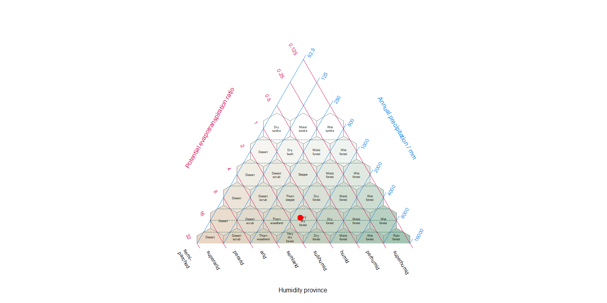

<!-- badges: start -->

[](https://github.com/jamestsakalos/climenv/actions/workflows/codemeta.yml)
[](https://github.com/jamestsakalos/climenv/actions/workflows/lint.yaml)
[](https://github.com/jamestsakalos/climenv/actions/workflows/pkgdown.yml)
[](https://github.com/jamestsakalos/climenv/actions/workflows/R-CMD-check.yml)
[](https://github.com/jamestsakalos/climenv/actions/workflows/test-coverage.yaml)
<!-- badges: end -->

<!-- README.md is generated from README.Rmd. Please edit that file -->

# climenv

R functions for downloading, extracting, and plotting climatological
data as a function of user supplied multi and single geospatial polygon
and point data.

## Description

If you are a scientist seeking a convenient solution for downloading,
extracting , and plotting climatological data, consider exploring the
features of this package. It grants you access to three widely
recognised modelled data sets, namely WorldClim 2, CHELSA, and NASA’s
SRTM. It seamlessly handles both multi and single geospatial polygon and
point data, allowing you to extract outputs that can serve as covariates
in various ecological studies. It also allows you to visualise these
extractions using two common graphic options – the Walter-Lieth climate
diagram and the Holdridge life zone classification scheme. The last
option is a scheme of our own design which incorporates aspects of both
Walter-Leigh and Holdridge. The package’s user-friendly access and
extraction of globally recognisable data sets significantly enhance its
versatility and usability across a broad spectrum of applications.

For any questions, comments or bug reports please submit an issue here
on GitHub. Suggestions, ideas and references of new algorithms are
always welcome.

## News

- June-2023: Version 1.0.0

## Main functionalities

- Downloads climate data from two main sources;
  - CHELSA, short for “Climatologies at High resolution for the Earth’s
    Land Surface Areas,” encompasses a high-resolution gridded dataset
    containing extensive climate data, including temperature and
    precipitation for the period 1981–2010
  - WorldClim 2, short for “World Climate”, is a comprehensive global
    dataset offers fine-scale gridded climate data including temperature
    and precipitation for the period 1970–2000
- Downloads elevation data from two main sources;
  - SRTM, which stands for ‘Shuttle Radar Topography Mission,’ refers
    specifically to the hole-filled CGIAR-SRTM dataset, providing
    90-meter resolution elevation data for the Earth’s surface within
    latitudes ranging from -60 to 60 degrees
  - Mapzen’s synthesis digital elevation product which combines several
    sources of digital elevation models, including SRTM, the ArcticDEM
    (covering all areas north of 60°), EUDEM (digital elevation model
    over Europe)
- Extracts the data;
  - as raw data for points
  - as zonal statistics for a group of points or over a spatial extent
    (polygon)

## Installation from the source

You can install the development version from
[GitHub](https://github.com/jamestsakalos/climenv) with:

``` r
# install.packages("devtools")
devtools::install_github("jamestsakalos/climenv", build_vignettes = TRUE)
```

## Example

This is a basic example which shows you how to use the main `climenv`
function:

``` r
library(climenv)

# Step 1. Import the Sibillini National Park Boundary
# Step 2. Run the download function
# Step 3. Run the extract function
#* See ce_download & ce_extract documentation

# Steps 1, 2 & 3 can be skipped by loading the extracted data
data("it_data")

# Step 4. Visualise the climatic envelope using a Holdridge diagram
p1 <- plot_h(data = it_data, "MED")
```



The package vignette provides detailed explanation and demonstration on
the application of climenv.

## References

Fick, S.E. & R.J. Hijmans. (2017). WorldClim 2: new 1km spatial
resolution climate surfaces for global land areas. *International
Journal of Climatology*. 37, 4302–4315.

Hijmans, R.J., Barbosa, M., Ghosh, A., & Mandel, A. (2023). geodata:
Download Geographic Data. R package version 0.5-8.
<https://CRAN.R-project.org/package=geodata>

Hollister, J. (2022). elevatr: Access Elevation Data from Various APIs.
R package version 0.4.2. <https://CRAN.R-project.org/package=elevatr>

Karger, D.N., Conrad, O., Böhner, J., Kawohl, T., Kreft, H., Soria-Auza,
R.W. et al (2017) Climatologies at high resolution for the earth’s land
surface areas. *Scientific Data*, 4, 170122.

Karger, D.N., Conrad, O., Böhner, J., Kawohl, T., Kreft, H., Soria-Auza,
R.W. et al. (2021) Climatologies at high resolution for the earth’s land
surface areas. *EnviDat*.
